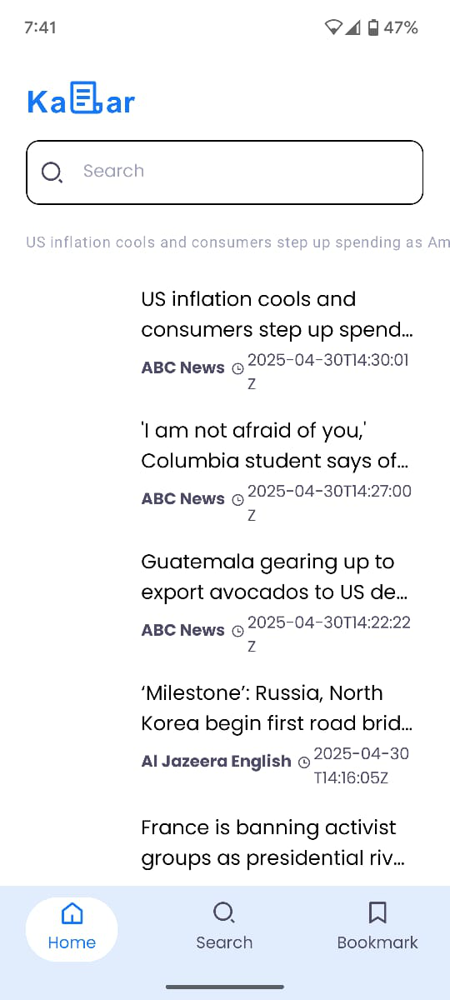
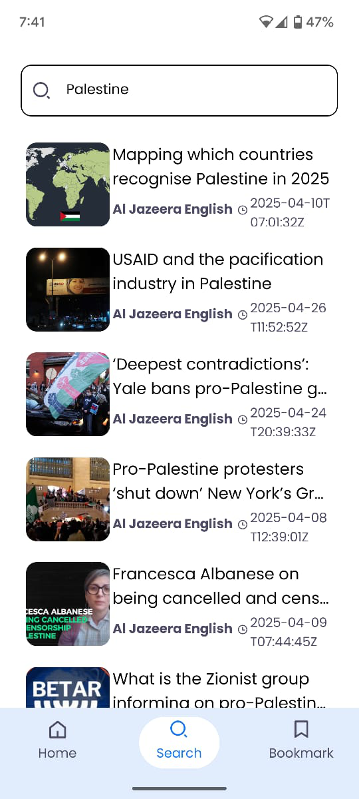
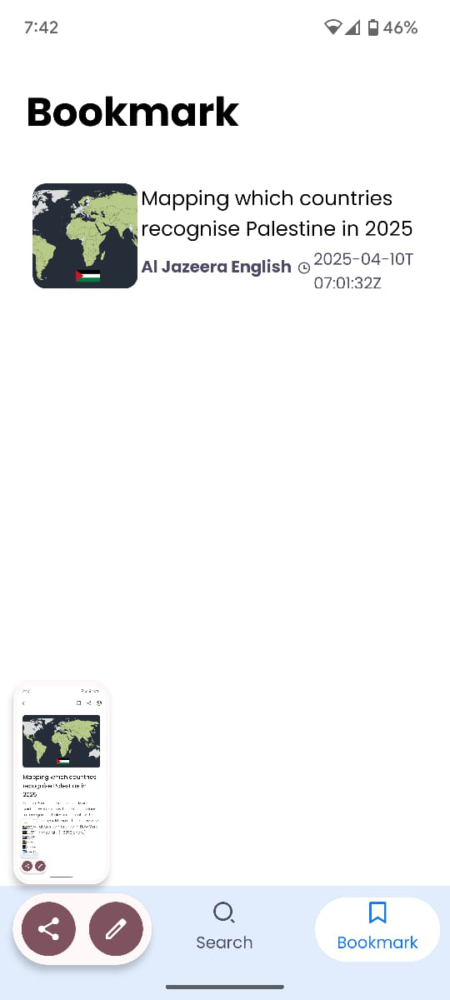

# 📰 News App

A beautifully designed and fully functional News App developed in **Native Android (Kotlin)** using **Jetpack Compose** and **Clean Architecture**. Browse the latest headlines, search news, bookmark your favorites, and experience smooth navigation — all with stunning **light and dark mode support**.

---

## ✨ Features

- ✅ **Splash Screen** with smooth transition
- ✅ **Onboarding Flow** (3 Pages) with dot indicators
- ✅ **Latest News** displayed on Home screen using Paging 3
- ✅ **Top Headline Banner**
- ✅ **Search Functionality** with live API querying
- ✅ **Bookmark Articles** locally with Room DB
- ✅ **Bottom Navigation Bar** (Home, Search, Bookmarks)
- ✅ **Article Detail Screen** with:
  - Open in browser
  - Share functionality
  - Save/Bookmark option
- 🌗 **Light & Dark Mode** support

---

## 🧰 Tech Stack

| Layer            | Technology                            |
|------------------|----------------------------------------|
| UI               | Jetpack Compose                       |
| Architecture     | MVVM + Clean Architecture             |
| DI               | Hilt                                  |
| Networking       | Retrofit + OkHttp                     |
| Pagination       | Paging 3                              |
| Local Storage    | Room DB                               |
| Preferences      | DataStore (if used)                   |
| State Management | ViewModel + StateFlow                 |
| Image Loading    | Coil (optional but common)            |

---

## 📷 Screenshots

### 🔆 Light Mode & 🌙 Dark Mode

| Splash | Onboarding | Home | Search | Article Detail |
|--------|------------|------|--------|----------------|
|  |  |  |  |  |

> 💡 Tip: Place all screenshots inside a `/screenshots/` folder in the root directory.

---

## 🚀 How to Use

1. Clone this repository:
   ```bash
   git clone https://github.com/mashhukhangandapur/newsApp.git
